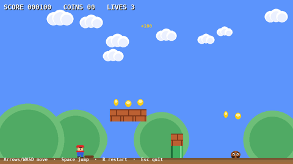
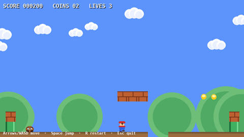
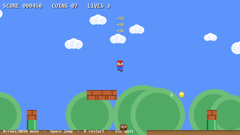
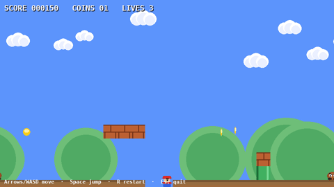

# Super Block Bros

A simple Mario-style platformer built with pygame. All graphics are drawn
procedurally — no image assets needed.

| Self-play: stomp + coins | Self-play: jumping both pits |
|---|---|
|  |  |

| Self-play: finishing the level | Dumb-bot mode: death + respawn |
|---|---|
|  |  |

## Play

```bash
./run.sh        # creates the venv and installs pygame on first run
```

Or manually:

```bash
python3 -m venv .venv && .venv/bin/pip install pygame
.venv/bin/python mario.py
```

## Controls

| Key | Action |
|-----|--------|
| Arrows / A-D | Move |
| Space / W / Up | Jump |
| R | Restart (game over / win / anytime) |
| Esc | Quit |

## Features

- Tile-based collision (ground, bricks, pipes)
- Goombas: stomp from above for +100, side-touch costs a life (3 lives)
- Spinning coins (+50 each)
- Flag finish with level-clear screen
- Scrolling camera, parallax hills and clouds
- HUD with score / coins / lives

## Self-play bot

`bot.py` plays the level headlessly and logs every frame as JSONL plus
optional screenshots:

```bash
.venv/bin/python bot.py                          # winning playthrough + event log
.venv/bin/python bot.py --no-jump --record /tmp/frames --log /tmp/run.jsonl
```

The GIFs in this README were cut from those frame dumps with ffmpeg (see
`LEARNINGS.md` for the exact command).

## Tests

```bash
.venv/bin/python tests/e2e.py   # 8-check acceptance suite (bot must win)
```

## Learnings

[`LEARNINGS.md`](LEARNINGS.md) documents the three real bugs found while
building this (floating level geometry, broken collision resolver, a
tuple-unpacking bug), how they were isolated, and the verification process.
